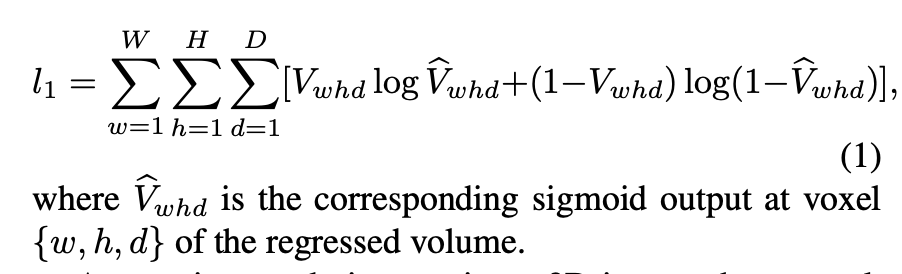
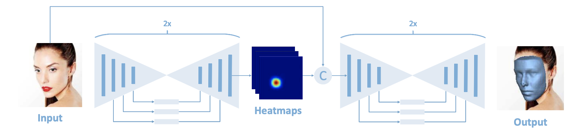
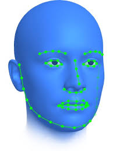

# 🔍Efficient Multi-View 3D Model Reconstruction Using CNN Regression

<!--TOC-->

* [🚀 Motivation and Explanation of Title](#🚀-motivation-and-explanation-of-title)
    * [🤔 What problem are we tackling](#🤔-what-problem-are-we-tackling)
        * [🧮 Methods](#🧮-methods)
        * [💡 Solution](#💡-solution)
    * [🧐 Explanation of title](#🧐-explanation-of-title)
* [📚 Resources](#📚-resources)
    * [📑 Papers](#📑-papers)
    * [📊 Datasets](#📊-datasets)
    * [💻 Project Source Code](#💻-project-source-code)

## 🚀 Motivation

😎 The motivation behind our project is rooted in the love for animals and the intrest in expanding our knowledge of field of computer vision. 

💭 When browdsing the web for ideas we came across human facila and body 3D reconstruction for extended reality including AR and VR.

🐈 Following the further inpsirations from one, Little Genius Application (youtube video link), and two, Apple's vision in realizing mixed-reality, or augmented reality, world, we decided to research and develop the less explored computer vision program for animals.

<!-- add the large files -->

🐶 In this project, we aim to reconstruct 3D animals facial model from 2D target images to 3D which eventually would stinulate and enable application development revolving around interacting and involving digitized 3D pets and wildlife experiences in the extended reality 🐕‍🦺🐈🐅🐧🦁🦭.

👓 Applications which brings the beloved pet into the digitized analog world are, for example, in pet care industry, where one can through light-weighted AR glasses monitor the health and the motion of their pets in real-time, interact with their at-home pet dyanimcally. Similarity, in the general pet-afterlife industry, one can relive vivdly the moments with their past pets in such extended realty by initially storing its digitized behavioral model the extended reality cloud memory. Or, at last, for all the potenail 3D extended world development, wildlife and domesticated animals cab be included as well.

### 🤔 What problem are we tackling

#### 2D to 3D facial reconstruction ####
* Traditional 3D reconstruction methods ofter require expensive and time-consuming technology, like 3D-scanning <a href="https://en.wikipedia.org/wiki/3D_scanning">Source to Wikipedia</a>, or even manual reconstriuction in 3D software (Inventor, AutoCad, Solidworks), which are not feasible for large-scale applications or capturing animals in their natural habitats.

* As to conventional methodological challenges such as establishing dense correspondences across large facial poses, expressions, and non-uniform illumination, these methods in general requires complex pipelines and solving non-convex difficult optimization problems for both model building (during training) and model fitting (during testing)

* However, in this project, we will utilize the Convolutional Neural Network (CNN) framework proposed in <a href="#paper7"> [7]</a> to address many of these limitations by training the model on appropriate dataset consisting of 2D images and 3D facial models or scans.

#### Extended challenges aroused from Animal facial reconstruction ####
* To extract correctly the animal facial model, in this project we simplify our tasks by applying the windowing method on the animal image datasets that only animals faces contained in a small window with less background interference of natural habitat is to be processed.

* Additional oncerns involves multiple-domain image-to-image translation model. A good model should learn a mapping between different visual domains satisfying the following properties: 
    1) diversity of generated images 
    2) scalability over multiple domains. 
Existing methods address either of the issues leading to limited diversity or multiple models for all domains. 
* Domain implies a set of images that can be grouped as a visually distinctive category, where each image has a unique appearance which we call style.

#### 🧮 Methods
The principle algorithm for this project is Neural Networks, where all the remaining methods are to assist in optimizaing neural network computation efficiency and to minimize error between the expected output and the actual output.
#### 2D to 3D facial reconstruction ####
* **CNN** : direct regression of a volumetric 3D facial geometry representation from a single 2D image <a href="#paper7"> [7]</a> based on the “hourglass network”.
- **The CNN architecture feaures** 
    1) working with just a single 2D facial image that does not require accurate alignment nor establishes dense correspondence between images
    2) works for arbitrary facial poses and expressions, and can be used to reconstruct the whole 3D facial geometry (including the non-visible parts of the face) bypassing the construction (during training) and fitting (during testing) of a 3D Morphable Model (3DMM).
        * 3DMM is to estimates 3D facial structure from a single image using an iterative training process. However, it's prone to failure, requires careful initialization, and involves solving a slow, complex optimization problem.
- **Volumetric Regression Networks (VRN) Method**
    * discretizing the 3D space into voxels {w, h, d}, assigning a value of 1 to all points enclosed by the 3D facial scan, and 0 otherwise. 
    * ${V_{whd}}$ is the ground truth for voxel {w, h, d} and is equal to 1, if voxel {w, h, d} belongs to the 3D volumetric representation of the face and 0 otherwise (i.e. it belongs to the background).
    * **VRN guided by facial landmarks**
        1) input an RGB image stacked with 68 channels, each containing a Gaussian (σ = 1, approximate diameter of 6 pixels) centred on each of the 68 landmarks.
        2) detects the 2D projection of the 3D landmarks by performing a simpler face analysis task
        3) train a stacked hourglass network which accepts guidance from landmarks during training and inference
        4) stacks these with the original image where each rectangle is a residual module of 256 feature 
        5) fed the stack into the reconstruction network to directly regresses the volume: 
        * The volumetric regression uses the sigmoid cross entropy loss function:
            

            
             
            <a href="#paper7"> [7]</a>
            

        6) output a volume of 192 × 192 × 200 of real values
    * **VRN - Guided architecture** 
        

        
         
        <a href="#paper7"> [7]</a>
        

#### Extended challenges aroused from Animal facial reconstruction ####
To deliver a real-time computable, superiority in terms of visual quality, diversity, and scalability framework, the following methods are being proposed for this project:

1) Proposing the usage of StarGAN v2, a single framework that tackles both and shows significantly improved results over the baselines.  [5]
2) Utilize the readily available high-quality animal faces datasets with large inter- and intra-domain differences to train and validate our design.
3) _not yet finihsed_  [6]
4) _not yet finihsed_ Volumetric regression [7]
5) Neural networks linear regression
6) possible Principal Component Analysis Problem Formulation
6) Sliding Windows

#### 💡 Solution

We will try to use the power of ML to make this possible.

By doing so, researchers, biologist, vetnarie, and educatorscan easily access 3D images/models of animals for various purposes: anatomy, sick-ness behaviour, behavior in general, or even creating realistic simulations.

Even more so we think this has a potential to be using the gaming industry, where 3D models are used to create realistic simulations of animals. Think about the MetaVerse, you want your pet to be in the game?  You don't want to spend hours creating it? Just take a few pictures of it and the game will create a 3D model of it.

### 🧐 Explanation of title

 - **Efficient Multi-View**: The model is able to reconstruct the animal from multiple images. This is a very important feature since we want to be able to reconstruct the animal from multiple images.
 - **3D**: The model is able to reconstruct the animal in 3D. This is a very important feature since we want to be able to reconstruct the animal in 3D. (This will be in a simple sparce 3D face modeling format) see picture from paper below.
 - **Reconstruction**: Talks for itself

- **CNN Regression**: The model uses a CNN to regress the 3D model from the input images. This is a very important feature since we want to be able to reconstruct the animal from multiple images<a href="#paper2"> [2]</a><a href="#paper3"> [3]</a><a href="#paper4"> [4]</a>.

    
     
    From paper <a href="#paper1"> [1]</a>

# 📚 Resources

## 📑 Papers

[1] *Wood, E. et al. (2022). **3D Face Reconstruction with Dense Landmarks**. In: Avidan, S., Brostow, G.*, Cissé, M., Farinella, G.M., Hassner, T. (eds) Computer Vision – ECCV 2022. ECCV 2022. Lecture Notes in Computer Science, vol 13673. Springer, Cham.. 

[2] *Lawin, F. J., Moeller, M.-M., & Petersson, L*. (2017). **MVSNet: Depth Inference for Unstructured Multi-view Stereo.** Computer Vision and Pattern Recognition (CVPR).

[3] *Fanzi Wu, Linchao Bao, Yajing Chen, Yonggen Ling, Yibing Song, Songnan Li, King Ngi Ngan, Wei Liu*. (2019). **MVF-Net: Multi-View 3D Face Morphable Model Regression**. Proceedings of the IEEE/CVF Conference on Computer Vision and Pattern Recognition (CVPR), 2019, pp. 959-968

[4] *Vasquez-Gomez, J.I., Troncoso, D., Becerra, I. et al*. **Next-best-view regression using a 3D convolutional neural network**. Machine Vision and Applications 32, 42 (2021).

[5] *Y. Choi, Y. Uh, J. Yoo and J. -W. Ha*, **StarGAN v2: Diverse Image Synthesis for Multiple Domains**. 2020 IEEE/CVF Conference on Computer Vision and Pattern Recognition (CVPR), Seattle, WA, USA, 2020, pp. 8185-8194.

[6] *Y. -Y. Liang and Y. -G. Wang*, **PFC-UNIT: Unsupervised Image-to-Image Translation with Pre-Trained Fine-Grained Classification**. 2023 IEEE International Conference on Image Processing (ICIP), Kuala Lumpur, Malaysia, 2023, pp. 1175-1179.

[7] *A. S. Jackson, A. Bulat, V. Argyriou and G. Tzimiropoulos*, **Large Pose 3D Face Reconstruction from a Single Image via Direct Volumetric CNN Regression**, 2017 IEEE International Conference on Computer Vision (ICCV), Venice, Italy, 2017, pp. 1031-1039, doi: 10.1109/ICCV.2017.117.

## 📊 Datasets
* [Kaggle face recognition dataset collection](https://www.kaggle.com/datasets?search=fac&tags=13207-Computer+Vision) 
* [Kaggle Facial keypoint detection](https://www.kaggle.com/datasets/nagasai524/facial-keypoint-detection) 
* [Kaggle Animal faces](https://www.kaggle.com/datasets/andrewmvd/animal-faces/data) 

## 💻 Project Source Code
* [3D Face Reconstruction using CNN](https://github.com/AaronJackson/vrn) 
* [500 ML Project](https://github.com/ashishpatel26/500-AI-Machine-learning-Deep-learning-Computer-vision-NLP-Projects-with-code)
