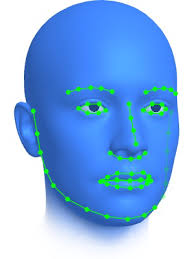

# Large Pose Three-Dimensional Animal Morphology Reconstruction Using Direct Volumetric CNN Regression

## Motivation and explenation of title

First of all the motivation behind our project is rooted in the love for animals and our ignorance of computer vision graphics. We both thought tackling a problem in the field of computer vision would be a great way to learn more about the field and to get a better understanding of the possibilities and limitations of the field.

Second of all, when surfing the web for ideas we found a face reconstruction project that was very interesting. Now since we both like animals and wanted to deliver a creative project we decided to try the same but for animals.

### Explanation of title

 - Large Pose: The model is able to reconstruct the animal in a large variety of poses. This is a very important feature since we want to be able to reconstruct the animal in any pose.
 - Three-Dimensional: The model is able to reconstruct the animal in 3D. This is a very important feature since we want to be able to reconstruct the animal in 3D. (This will be in a simple sparce 3D face modeling format) see picture from paper below.

    
     
    From paper <a href="#paper1"> [1]</a>

# Resources

## Papers

[1] (Wood, E. et al. (2022). 3D Face Reconstruction with Dense Landmarks. In: Avidan, S., Brostow, G., Cissé, M., Farinella, G.M., Hassner, T. (eds) Computer Vision – ECCV 2022. ECCV 2022. Lecture Notes in Computer Science, vol 13673. Springer, Cham. https://doi.org/10.1007/978-3-031-19778-9_10)

## Datasets
* [Kaggle face recognition dataset collection](https://www.kaggle.com/datasets?search=fac&tags=13207-Computer+Vision) 
* [Kaggle Facial keypoint detection](https://www.kaggle.com/datasets/nagasai524/facial-keypoint-detection) 
* [Kaggle Animal faces](https://www.kaggle.com/datasets/andrewmvd/animal-faces/data) 

## Project Source Code
* [3D Face Reconstruction using CNN](https://github.com/AaronJackson/vrn) 
* [500 ML Project](https://github.com/ashishpatel26/500-AI-Machine-learning-Deep-learning-Computer-vision-NLP-Projects-with-code)
