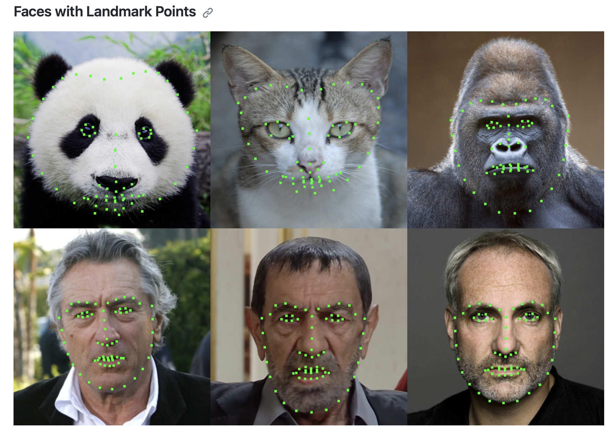

# Trello

Link to trello is [here](https://trello.com/invite/b/PDlvtlED/ATTI80751ddf1d8b0471659f54c7dce4e5f7BDA5DE8F/funnymodel)

# What needs to change?

- Change title : Jeffee
- Change motivation : Jeffee ✅ (done)
- Problem we tackling : Joerie
- Methods : Jeffee
- Solution : Joerie
- Explenation of title : Joerie 
- Papers : Jeffee
- Update images and videos : Joerie
- Restructure readme : Jeffee

# What do we need to have unti next milestone?

We need to:
- Go through [This part](#💻-project-source-code) first repo and see if we can use it for our project
- Go through the lectures for nural networks
- What steps are we going to use?
- Additionally, YouTube tutorials are very useful
  - share the link if you find some interesting
- Start coding
  - Make plan:
    - who does what
    - who does paper
    - who does code
    - who does poster
- SHOW REUSE OF CODE FROM LABS
- Get theory why use this blablalba 2 + 2 = 4

# 🔍Efficient Multi-View 3D Model Reconstruction Using CNN Regression

<!--TOC-->

* [🚀 Motivation and Explanation of Title](#🚀-motivation-and-explanation-of-title)
    * [🤔 What problem are we tackling](#🤔-what-problem-are-we-tackling)
        * [🧮 Methods](#🧮-methods)
        * [💡 Solution](#💡-solution)
    * [🧐 Explanation of title](#🧐-explanation-of-title)
* [📚 Resources](#📚-resources)
    * [📑 Papers](#📑-papers)
    * [📊 Datasets](#📊-datasets)
    * [💻 Project Source Code](#💻-project-source-code)

## 🚀 Motivation

😎 The motivation behind our project is rooted in the love for animals and the intrest in expanding our knowledge of field of computer vision. 

💭 When browdsing the web for ideas we came across face detection and its application in 3D reconstruction for extended reality including AR and VR. Having this face detection idea in mind and having discovered that such methodology and research is less applied in the animal domain, we decided to evaluate the application possibilty of this CNN-regression-based image classification model on cats and dogs. Upon researching, a semi-commercialized real-world application, Little Genius Application (youtube video link), came up, proving the idea feasibility.

<!-- add the large files -->

🐶 In this project, given the time constraint, we aim to based on the pets facial expression dataset  construct a model to firstly recognize the type of the pet and secondly classify the emotion of the pe into simply three class "happy","sad", and "angry", based on their facial expression. Hopefully contribute to the application development revolving around human-pet interactions in extended reality 🐕🐈.

👓 Potential use cases
* Facial expression recognition: The dataset can be used to train and evaluate models that can recognize the emotions of pets from their facial expressions. This can help pet owners understand their pets better and improve their well-being.
* Pet identification: The dataset can be used to train and evaluate models that can identify the species and breed of pets from their face images.

### 🤔 What problem are we tackling

#### 2D to 3D facial reconstruction ####
* Traditional 3D reconstruction methods ofter require expensive and time-consuming technology, like 3D-scanning <a href="https://en.wikipedia.org/wiki/3D_scanning">Source to Wikipedia</a>, or even manual reconstriuction in 3D software (Inventor, AutoCad, Solidworks), which are not feasible for large-scale applications or capturing animals in their natural habitats.

* As to conventional methodological challenges such as establishing dense correspondences across large facial poses, expressions, and non-uniform illumination, these methods in general requires complex pipelines and solving non-convex difficult optimization problems for both model building (during training) and model fitting (during testing)

* However, in this project, we will utilize the Convolutional Neural Network (CNN) framework proposed in <a href="#paper6"> [6]</a> to address many of these limitations by training the model on appropriate dataset consisting of 2D images and 3D facial models or scans.

#### Extended challenges aroused from Animal facial reconstruction ####
* To extract correctly the animal facial model, in this project we simplify our tasks by applying the windowing method on the animal image datasets that only animals faces contained in a small window with less background interference of natural habitat is to be processed.

* Additional oncerns involves multiple-domain image-to-image translation model. A good model should learn a mapping between different visual domains satisfying the scalability over multiple domains. 
* Domain implies a set of images that can be grouped as a visually distinctive category, where each image has a unique appearance which we call style. In the project context, challenge would be to transform the facial landmakrs model that is suitable for human domain to one for animal domain.

#### 🧮 Methods
The principle algorithm for this project is Neural Networks, where all the remaining methods are to assist in optimizaing neural network computation efficiency and to minimize error between the expected output and the actual output.
#### 2D to 3D facial reconstruction ####
* **CNN** : direct regression of a volumetric 3D facial geometry representation from a single 2D image <a href="#paper6"> [6]</a> based on the “hourglass network”.
- **The CNN architecture feaures** 
    1) working with just a single 2D facial image that does not require accurate alignment nor establishes dense correspondence between images
    2) works for arbitrary facial poses and expressions, and can be used to reconstruct the whole 3D facial geometry (including the non-visible parts of the face) bypassing the construction (during training) and fitting (during testing) of a 3D Morphable Model (3DMM).
        * 3DMM is to estimates 3D facial structure from a single image using an iterative training process. However, it's prone to failure, requires careful initialization, and involves solving a slow, complex optimization problem.
- **Volumetric Regression Networks (VRN) Method**
    * discretizing the 3D space into voxels {w, h, d}, assigning a value of 1 to all points enclosed by the 3D facial scan, and 0 otherwise. 
    * ${V_{whd}}$ is the ground truth for voxel {w, h, d} and is equal to 1, if voxel {w, h, d} belongs to the 3D volumetric representation of the face and 0 otherwise (i.e. it belongs to the background).
    * **VRN guided by facial landmarks**
        1) input an RGB image stacked with 68 channels, each containing a Gaussian (σ = 1, approximate diameter of 6 pixels) centred on each of the 68 landmarks.
        2) detects the 2D projection of the 3D landmarks by performing a simpler face analysis task
        3) train a stacked hourglass network which accepts guidance from landmarks during training and inference
        4) stacks these with the original image where each rectangle is a residual module of 256 feature 
        5) fed the stack into the reconstruction network to directly regresses the volume: 
        * The volumetric regression uses the sigmoid cross entropy loss function:
        6) output a volume of 192 × 192 × 200 of real values
    * **VRN - Guided architecture** 
     

    
     
    Sigmoid cross entropy loss function<a href="#paper6">[6]</a>

 

    
     
    VRN - Guided architecture<a href="#paper6">[6]</a>

 

#### Extended challenges aroused from Animal facial reconstruction ####
1) To develop an animal facial landmark model, we can try utlizing the Style encoder and possibly Mapping Network proposed in StarGAN v2 model <a href="#paper5"> [5]</a>. The mapping network learns to transform random Gaussian noise into a style code, while the encoder learns to extract the style code from a given reference image.
2) Zhang et al. <a href="#paper7"> [7]</a> developed a structural hourglass network to predict the facial landmarks with corresponding heatmaps. The CNN based facial landmarks localization gets the high-level features from the face and predicts all the keypoints simultaneously, which method may help to construct the auto-detected animal facial landmark model.
3) Additionally, there is an existing automated python model for facial landmark detection between species as indicated in <a href="#💻-project-source-code"> Facial Landmark and Image Morhphine: Species <a> which we can reference to. The repository contains Python codes to detect facial landmarks of people and some animals as indicated in below figure. After finding these points, face morphing is applied to images by using delaunay triangulation.
 

    
     
    <a href="#facial_landmark">Facial Landmark Output</a>

 

#### 💡 Solution

We will try to use the power of ML to make this possible.

By doing so, researchers, biologist, vetnarie, and educatorscan easily access 3D images/models of animals for various purposes: anatomy, sick-ness behaviour, behavior in general, or even creating realistic simulations.

Even more so we think this has a potential to be using the gaming industry, where 3D models are used to create realistic simulations of animals. Think about the MetaVerse, you want your pet to be in the game?  You don't want to spend hours creating it? Just take a few pictures of it and the game will create a 3D model of it.

### 🧐 Explanation of title

 - **Efficient Multi-View**: The model is able to reconstruct the animal from multiple images. This is a very important feature since we want to be able to reconstruct the animal from multiple images.
 - **3D**: The model is able to reconstruct the animal in 3D. This is a very important feature since we want to be able to reconstruct the animal in 3D. (This will be in a simple sparce 3D face modeling format) see picture from paper below.
 - **Reconstruction**: Talks for itself

- **CNN Regression**: The model uses a CNN to regress the 3D model from the input images. This is a very important feature since we want to be able to reconstruct the animal from multiple images<a href="#paper2"> [2]</a><a href="#paper3"> [3]</a><a href="#paper4"> [4]</a>.

    
     
    From paper <a href="#paper1"> [1]</a>

# 📚 Resources

## 📑 Papers

[1] *Wood, E. et al. (2022). **3D Face Reconstruction with Dense Landmarks**. In: Avidan, S., Brostow, G.*, Cissé, M., Farinella, G.M., Hassner, T. (eds) Computer Vision – ECCV 2022. ECCV 2022. Lecture Notes in Computer Science, vol 13673. Springer, Cham.. 

[2] *Lawin, F. J., Moeller, M.-M., & Petersson, L*. (2017). **MVSNet: Depth Inference for Unstructured Multi-view Stereo.** Computer Vision and Pattern Recognition (CVPR).

[3] *Fanzi Wu, Linchao Bao, Yajing Chen, Yonggen Ling, Yibing Song, Songnan Li, King Ngi Ngan, Wei Liu*. (2019). **MVF-Net: Multi-View 3D Face Morphable Model Regression**. Proceedings of the IEEE/CVF Conference on Computer Vision and Pattern Recognition (CVPR), 2019, pp. 959-968

[4] *Vasquez-Gomez, J.I., Troncoso, D., Becerra, I. et al*. **Next-best-view regression using a 3D convolutional neural network**. Machine Vision and Applications 32, 42 (2021).

[5] *Y. Choi, Y. Uh, J. Yoo and J. -W. Ha*, **StarGAN v2: Diverse Image Synthesis for Multiple Domains**. 2020 IEEE/CVF Conference on Computer Vision and Pattern Recognition (CVPR), Seattle, WA, USA, 2020, pp. 8185-8194.

[6] *A. S. Jackson, A. Bulat, V. Argyriou and G. Tzimiropoulos*, **Large Pose 3D Face Reconstruction from a Single Image via Direct Volumetric CNN Regression**, 2017 IEEE International Conference on Computer Vision (ICCV), Venice, Italy, 2017, pp. 1031-1039, doi: 10.1109/ICCV.2017.117.

[7] *J. Zhang, H. Hu and S. Feng*, **Robust Facial Landmark Detection via Heatmap-Offset Regression**, in IEEE Transactions on Image Processing, vol. 29, pp. 5050-5064, 2020.

## 📊 Datasets

* [Kaggle 🐶Pet's Facial Expression Image Dataset😸](https://www.kaggle.com/datasets/anshtanwar/pets-facial-expression-dataset/data) 
* [Kaggle Animal faces](https://www.kaggle.com/datasets/andrewmvd/animal-faces/data) 

## 💻 Project Inspiration
* [CNN | Beginners | 🐶Pet's Expression Recognition](https://www.kaggle.com/code/anshtanwar/cnn-beginners-pet-s-expression-recognition) 
* [500 ML Project](https://github.com/ashishpatel26/500-AI-Machine-learning-Deep-learning-Computer-vision-NLP-Projects-with-code)

* [Facial Landmark and Image Morhphine: Species](https://github.com/emreslyn/facial_landmark_and_image_morphing)
