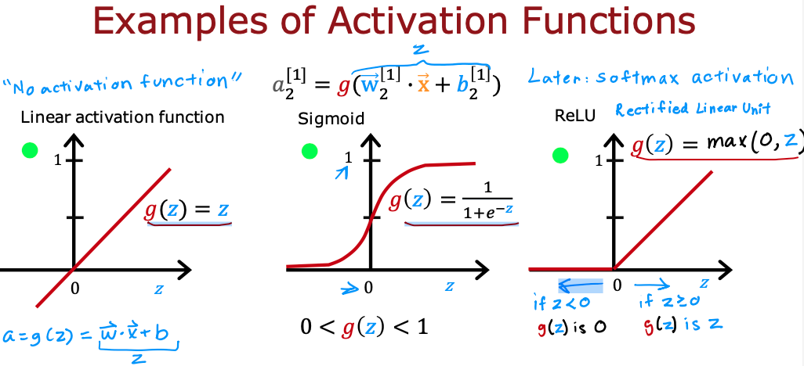
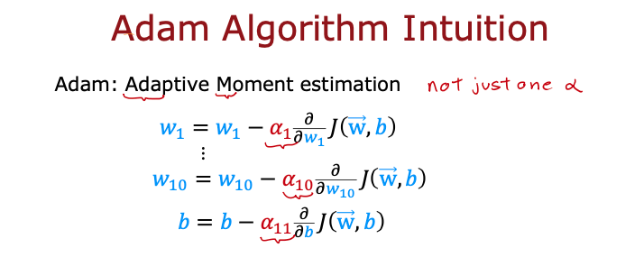

# 🔍Bridging the Gap: Pet Facial Expression Recognition for Enhanced XR Human-Pet Interactions
Our project explores the use of Convolutional Neural Networks (CNNs) and transfer learning for recognizing facial expressions in pets, aiming to enhance remote healthcare assessment and behavioral monitoring. We focus on accurately identifying pet species and their emotional states such as happiness, anger, and sadness
<!-- TOC -->
* [🔍Bridging the Gap: Pet Facial Expression Recognition for Enhanced XR Human-Pet Interactions](#bridging-the-gap-pet-facial-expression-recognition-for-enhanced-xr-human-pet-interactions)
  * [🤔Motivation: what problems are we tackling](#motivation-what-problems-are-we-tackling)
  * [💡 Solution](#solution)
  * [🧮 Method](#method)
  * [📊 Dataset and Features](#dataset-and-features)
  * [📑 Results/Discussion](#resultsdiscussion)
  * [📰 Poster](#poster)
  * [📚 References](#references)
    * [📑 Literature](#literature)
    * [💻 Related Works](#related-works)

## Research Focus
The study revolves around the question of how transfer learning can empower a model to classify a wide range of emotional states in various pet species, ensuring accuracy for applications in remote healthcare assessment and behavioral monitoring.

## 🤔Motivation: what problems are we tackling
In extended reality (XR), the integration of pets into virtual spaces has created for a wide range of new possiblities. However, there's still a significant void in understanding the emotianal nuances of pets in XR. We will try to enhance the technology by developing a model that (a) identifies between two different pet types (cats and dogs) and (b) classify between different facial expressions (happy, sad, angry and relaxed)<a href="paper1">[1]</a>. Additoinally, the article <a href="paper2">[2]</a> has presented the importance of accurate recognition and assessment of pain in animals that is crucial in clinical contexts for pain management and welfare assessment, especially in the veterinary clinical studies.

**Potential use case**

Our model could find it's application in remote pet monitoring for healthcare assessment. For instance: by using 
<a href="https://en.wikipedia.org/wiki/Remote_camera">trail cameras</a> biologists, researchers, or even hobbyist could remotely look at the emotial state of an animal; conclude distress; behavioural change and so forth. We think this model has huge potential, especially when this model could get extended to multiple animals and multiple emotions.  

## Model Development
We developed three models for identifying pet emotions:
1. Fully-connected layers baseline model
2. Advanced CNN model with transfer learning
3. EfficientNetB5-based model

## Objectives
- **Pet Identification**: To accurately identify cats and dogs within images.
- **Emotion Detection**: Detect and classify emotional states (happy, angry, sad, relaxed) in pets.

## 🧮 Methods
**Baseline model**: One requirement for this project is to develop based on the taught/used code snippets. In our case, as the emotion classification on top of the cat and dog face recongition is a multicalss classification problem and that the nature of emotion having a zero state where there is no emotion and an continuous range of values, an activation function of **Rectified Linear Unit (ReLU)** in the **Neural Networks** would suit the purpose of the classifier better than of sigmoid. **sigmoid** is best for on/off binray situations. **The ReLU provides a continuous linear relationship**. Additionally it has an **'off' range** where the output is zero. The **"off"** or disable feature of the ReLU activation enables models to **stitch together linear segments to model complex non-linear functions**.

**ReLU Activation Definition**
$$a = \max(0,z)\tag{1}$$

```python
def relu(z):
    return max(0, z)
```

<p align="center">
  
  <br>
  <strong>Fig. 1</strong>: Sigmoid and ReLU activation function<a name="paper3">[3]</a>
</p>

**Softmax Regression**: Given that one output is selected as the predicted answer out of N outputs yielded by the multiclass neural network, softmax function is exploited to process the N outputs as a **linear vector 𝐳** and converts  𝐳  into a **probability distribution**. Each output after softmax application will range $\in[0,1]$ and will sum to 1. They can be interpreted as probabilities.
<p align="center">
  
  <br>
  <strong>Fig. 2</strong>: Coursera: Advanced Learning Algorithms<a name="paper3">[3]</a>
</p>

**The softmax function can be written:**
$$a_j = \frac{e^{z_j}}{ \sum_{k=0}^{N-1}{e^{z_k} }} \tag{2}$$

Where $z = \mathbf{w} \cdot \mathbf{x} + b$ and N is the number of feature/categories in the output layer. 

```python
def softmax(z):
    ez = np.exp(z)      #element-wise exponenial
    sm = ez/np.sum(ez)
    return(sm)
```

**Optimization: Adaptive Moment estimation (Adam)**: 
ADAM is an optimization algorithm that by holding the core principle of **maintianing a moving avergae** of both the 1) **gradients** and 2) the **squares** of the gradients of the loss function, computing each firstly the gradient of the loss function for a batch of data, update the bias, then again compute the squares of the gradients and update second time the bias to compensate and maintain a certain average, or momenteum. <br>
**In our case**, gradient optimization using ADAM to iteratively and **adaptively** update the learning rate of the loss function can ensure us a steady progress towards the converging point (minimum) when working with **sparse and/or noisy gradeint problems**.

<p align="center">
  
  
  <br>
  <strong>Fig. 3</strong>: ADAM Algorithm Intuition<a name="paper3">[3]</a>
</p>

**Proposed Model** will apply cronologically the following steps

1. Load <a name="pet's facial expression">data</a> by storing each image path (e.g. "```list[x] = "/images/happy/dog15.png```") in a list and it's corresponding label in another (```list2[x] = "happy"```)
2. Transform the lists into a dataframe
3. Exokiratiry Data Analysis (EDA) and analyze data to get more insights (just like we did in all the labs, explore data get familiar with it)
4. Create labels for each emotion category
5. Normalize pixel values to range [0, 1] for ReLU
6. encode the labels
7. Make train, test, and validate sets
8. Make Data Generator (DG) for Train, Test and Validate set. We can use Tensorflow Generator for it.
9. Build the CNN regression model: (inject lab code as baseline)
    * add layers of ReLU and Softmax. 
    * compile with Adam optimizer. 
10. Calculated class weights and pre-train the model with computed class weights. 
11. Check accuracy by evaluating the pre-trained model on test data.
12. Load test images, reshapte the iage to match the model input shape, map.
13. Evaluate the model prediction result on validate data by plotting the predicted label, images, and original images.

## 📊 Dataset and Features
<a name="pet's facial expression"></a>
[Kaggle 🐶Pet's Facial Expression Image Dataset😸](https://www.kaggle.com/datasets/anshtanwar/pets-facial-expression-dataset/data) <br>
This dataset contains 1000 face images of various pets, such as dogs, cats, rabbits, hamsters, sheep, horses, and birds, which will be used in our projects for emotion classification training and testing <br>

**Features**:<br>
The images capture the diversity of expressions these animals can display, such as happiness, sadness, anger etc, and provides a **classified and labeled** emotions features.<br>
The dataset can be processed using machine learning techniques to learn an algoirhtm for pet species identificatoin and gain insights into pet emotions and personalities, enabling the creation of projects with pet face images whlie contributing to pet face recognition research and animal welfare.<br>

<a name="Dog Emotions Prediction"></a>
[Kaggle Dog Emotions Prediction](https://www.kaggle.com/datasets/devzohaib/dog-emotions-prediction) <br>
This dataset is part of dataquest project-walkthrough. Images are downloaded from Flickr using API.

**Features**:<br> Idog images are classified into 4 category based on their emotions. these 4 category are
* happy
* sad
* angry
* relaxed

<a name="animal Faces"></a>
[Kaggle Animal faces](https://www.kaggle.com/datasets/andrewmvd/animal-faces/data) <br>
If one were to evalute subjectively the performance of our proposed model, this dataset, also known as Animal Faces-HQ (AFHQ), consists of 16,130 high-quality images at 512×512 resolution.<br>

**Features**:<br>
There are three domains of classes, each providing about 5000 images. By having multiple (three) domains and diverse images of various breeds per each domain, AFHQ sets a challenging image-to-image translation problem. The **provided classes labels** are: Cat, Dog, and Wildlife.


## 📑 Results/Discussion  
- Baseline model achieved 45% accuracy, the CNN model with transfer learning reached 62%, and the EfficientNetB5-based model excelled at 94%.
- The EfficientNetB5 model demonstrated robust generalization and high accuracy.

## Conclusion
Our study shows that transfer learning in advanced CNN and EfficientNetB5-based models significantly improves the accuracy of emotion recognition in pets. This advancement has profound implications for veterinary care and human-pet interactions.

## Poster
<p align="center">
  
</p>

## Acknowledgment
Special thanks to Meixing Liao, Meng Shang, and Prof. Bart Vanrumste for their support and contributions to this project.


# 📚 References

## 📑 Literature
<a name="paper1"></a>
[1] *Mao, Y., Liu, Y. **Pet dog facial expression recognition based on convolutional neural network and improved whale optimization algorithm.** Sci* Rep 13, 3314 (2023). [](https://doi.org/10.1038/s41598-023-30442-0)

<a name="paper2"></a>
[2] *Feighelstein, M., Shimshoni, I., Finka, L.R. et al. **Automated recognition of pain in cats**. Sci* Rep 12, 9575 (2022).
[](https://doi.org/10.1038/s41598-022-13348-1)

<a name="paper3"></a>
[3] *A. Wu, “**Online courses &amp; credentials from top educators. join for free**,” Coursera*, [](https://www.coursera.org/learn/advanced-learning-algorithms/home/welcome) (accessed Nov. 12, 2023). 


## 💻 Related Work
* [CNN | Beginners | 🐶Pet's Expression Recognition](https://www.kaggle.com/code/anshtanwar/cnn-beginners-pet-s-expression-recognition) 
<a name="facial_landmark"></a>
* [Facial Landmark and Image Morhphine: Species](https://github.com/emreslyn/facial_landmark_and_image_morphing)
